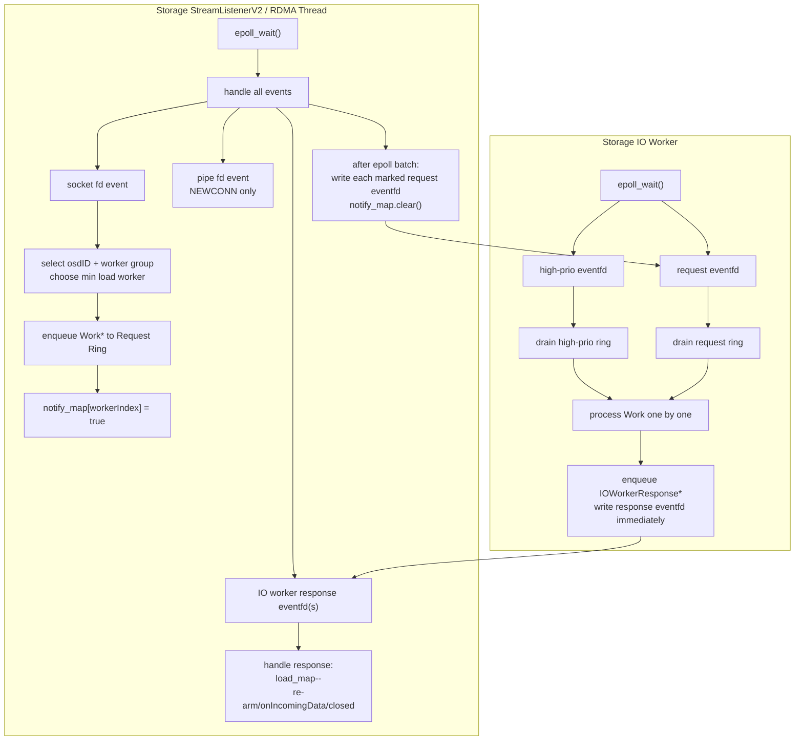

# Storage IO Lockless Thread Communication Design

## 1. Background

This document describes the phase-1 implementation plan for replacing the storage write-path thread communication between `StreamListenerV2` and storage IO workers.

The phase-1 goal is intentionally narrow:

- Replace storage listener -> IO worker dispatch with `rte_ring` + `eventfd`.
- Replace storage IO worker -> listener socket return with `rte_ring` + `eventfd`.
- Change storage IO worker waiting from `condvar` to `epoll_wait`.
- Keep synchronous message processing, payload receive, disk `pwrite`, RDMA send completion polling, and the existing business state machine unchanged.
- Keep non-storage paths, meta paths, and old common `StreamListenerV2` pipe behavior unchanged.

The design document uses `osdID` for the BeeGFS storage target identifier. This corresponds to `osd_id` in the original proposal.

## 2. Core Decisions

### Scope

Only storage daemon ordinary IO workers are changed in phase 1.

Not changed:

- meta workers
- mon/fsck/client module paths
- RDMA connection establishment
- `ConnAcceptor -> Listener` new-connection pipe path
- disk IO model
- RDMA sendCQ handling

### Queue Backend

Use the provided standalone DPDK-style ring implementation:

```text
/Users/panliu/Downloads/dpdk_ring_standalone/rte_ring_standalone.h
/Users/panliu/Downloads/dpdk_ring_standalone/rte_ring_standalone.c
```

Copy into BeeGFS common:

```text
common/source/common/toolkit/ring/rte_ring_standalone.h
common/source/common/toolkit/ring/rte_ring_standalone.c
```

Use `eventfd` for wakeup and `epoll_wait` for IO worker waiting.

### Ring Sizes

Default capacities:

```text
Request Ring: 128
Response Ring: 128
High-prio Ring: 128
```

Use `RING_F_EXACT_SZ` so the configured capacity means 128 usable entries.

### Ring Full Behavior

When a ring is full, the producer waits until enqueue succeeds:

```text
short spin
periodic sched_yield()
retry until success
```

No request is dropped. No overflow list is introduced in phase 1.

## 3. Architecture



## 4. Worker Group Model

For each `osdID`, storage IO workers are split by listener count.

If:

```text
numWorkers < numStreamListeners
```

startup fails with a configuration error. This preserves the SPSC request-ring model.

Worker group splitting uses continuous ranges:

```cpp
base = numWorkers / numListeners;
rem  = numWorkers % numListeners;

begin = listenerIndex * base + min(listenerIndex, rem);
size  = base + (listenerIndex < rem ? 1 : 0);
end   = begin + size;
```

Example:

```text
numWorkers = 10
numListeners = 3

listener 0: workerIndex 0,1,2,3
listener 1: workerIndex 4,5,6
listener 2: workerIndex 7,8,9
```

`workerIndex` is target-local:

```text
osdID 101: workerIndex 0..numWorkers-1
osdID 102: workerIndex 0..numWorkers-1
```

## 5. Load And Notification Maps

Each listener maintains load for workers it can submit to:

```text
load_map[osdID][workerIndex]
```

Rules:

- Listener successfully enqueues a request work: `load_map[osdID][workerIndex]++`
- Listener receives a worker response: `load_map[osdID][workerIndex]--`

Group-local worker selection:

```text
choose worker with the smallest load_map[osdID][workerIndex]
if tied, use round-robin cursor as tie-breaker
```

Listener notification is batched per epoll batch:

```text
onIncomingData(sock):
  enqueue Work* to selected worker request ring
  load_map[osdID][workerIndex]++
  notify_map[workerIndex] = true

after all epoll events in this batch are handled:
  for each marked worker:
    write(worker.requestEventFD)
  notify_map.clear()
```

Worker -> listener response notification is not batched in phase 1:

```text
enqueue IOWorkerResponse*
write(responseEventFD)
```

## 6. Data Structures

### RteRingQueue

Common wrapper around `rte_ring` and `eventfd`.

Proposed files:

```text
common/source/common/components/worker/queue/RteRingQueue.h
common/source/common/components/worker/queue/RteRingQueue.cpp
```

Responsibilities:

- own `rte_ring*`
- own `eventfd`
- provide typed-enough pointer queue operations
- wait-on-full enqueue helper
- burst dequeue
- eventfd read/write helpers

Expected API shape:

```cpp
class RteRingQueue
{
   public:
      RteRingQueue(const std::string& name, unsigned capacity, unsigned ringFlags);
      ~RteRingQueue();

      void enqueueWait(void* item);
      unsigned dequeueBurst(void** outItems, unsigned maxItems);

      int getEventFD() const;
      void notify();
      void drainEventFD();
      unsigned count() const;
};
```

### IOWorkerQueues

Common queue context assigned to one IO worker.

```cpp
struct IOWorkerQueues
{
   uint16_t osdID;
   unsigned workerIndex;
   unsigned listenerIndex;

   RteRingQueue* requestQueue;   // SPSC
   RteRingQueue* responseQueue;  // SPSC
   RteRingQueue* highPrioQueue;  // MP/SC
};
```

Request queue flags:

```text
RING_F_SP_ENQ | RING_F_SC_DEQ | RING_F_EXACT_SZ
```

Response queue flags:

```text
RING_F_SP_ENQ | RING_F_SC_DEQ | RING_F_EXACT_SZ
```

High-prio queue flags:

```text
RING_F_SC_DEQ | RING_F_EXACT_SZ
```

Do not set `RING_F_SP_ENQ` for high-prio because it has multiple producers.

### IOWorkerResponse

Response ring item sent by IO worker to listener.

```cpp
struct IOWorkerResponse
{
   Socket* sock;
   uint16_t osdID;
   unsigned workerIndex;
   bool hasImmediateData;
};
```

Rules:

```text
sock == nullptr:
  socket was already closed/deleted by worker
  listener only decrements load_map

sock != nullptr && hasImmediateData == false:
  listener re-arms socket in epoll

sock != nullptr && hasImmediateData == true:
  listener calls onIncomingData(sock)
```

No new `SockPipeReturnType` is introduced for the new response path.

## 7. StorageIOWorkerRouter

Storage-specific routing class.

Proposed files:

```text
storage/source/components/worker/StorageIOWorkerRouter.h
storage/source/components/worker/StorageIOWorkerRouter.cpp
```

Responsibilities:

- create per-worker `IOWorkerQueues`
- split workers into listener groups for each osdID
- select best worker in listener group
- enqueue request work
- maintain/coordinate load accounting helpers
- expose listener-owned response queues
- expose queue statistics

It does not live in `MultiWorkQueue`. `MultiWorkQueue` remains the legacy mutex/condvar queue for non-IO and old paths.

Expected API shape:

```cpp
class StorageIOWorkerRouter
{
   public:
      StorageIOWorkerRouter(unsigned numListeners, unsigned numWorkersPerOSD);

      void addOSD(uint16_t osdID);
      IOWorkerQueues* getWorkerQueues(uint16_t osdID, unsigned workerIndex);

      IOWorkerQueues* submit(uint16_t osdID, unsigned listenerIndex,
         Work* work, unsigned userID);

      std::vector<IOWorkerQueues*> getResponseQueuesForListener(unsigned listenerIndex) const;

      void complete(uint16_t osdID, unsigned workerIndex);

      size_t getPendingCount(uint16_t osdID) const;
      size_t getWorkerPending(uint16_t osdID, unsigned workerIndex) const;
      size_t getListenerGroupPending(uint16_t osdID, unsigned listenerIndex) const;
};
```

The exact method names can be adjusted during implementation.

## 8. Worker Changes

Add:

```cpp
QueueWorkType_IO
```

Storage ordinary IO workers are created with `QueueWorkType_IO`.

`Worker` receives an `IOWorkerQueues*` context. `Worker` must not depend on `StorageIOWorkerRouter`.

IO worker `epoll_wait` listens only to:

```text
request eventfd
high-prio eventfd
```

Not in phase 1:

- RDMA recvCQ fd
- sendCQ fd
- libaio eventfd
- timerfd
- shutdown eventfd

Processing order:

```text
epoll_wait()
read eventfd(s)
drain high-prio ring first
drain request ring second
process ready list in order
```

High-prio work always has priority over normal request work.

`DummyWork` for worker shutdown is submitted to high-prio ring and wakes the high-prio eventfd.

## 9. IncomingPreprocessedMsgWork Changes

Do not change the global `Work::process()` signature.

Add a lightweight tag hook to `Work`:

```cpp
virtual IncomingPreprocessedMsgWork* asIncomingPreprocessedMsgWork()
{
   return NULL;
}
```

`IncomingPreprocessedMsgWork` overrides it and returns `this`.

`IncomingPreprocessedMsgWork::process()` should record final socket state in the work object:

```text
valid socket, no immediate data
valid socket, immediate data
closed/deleted socket
```

The IO worker sends `IOWorkerResponse` after `process()` returns:

```text
work->process(...)
if work is IncomingPreprocessedMsgWork:
  response = work->detachIOWorkerResponse(osdID, workerIndex)
  responseQueue.enqueueWait(response)
  responseQueue.notify()
delete work
```

This centralizes response completion at the worker layer.

### Old Static releaseSocket Path

Keep the old static `IncomingPreprocessedMsgWork::releaseSocket(...)` behavior for paths not changed in phase 1, including meta paths such as mirrored messages.

This is not a fallback for the new storage IO path. It is an unchanged legacy path outside the phase-1 scope.

For storage IO new path, add member methods that do not write the old pipe. They only update final socket state.

## 10. StreamListenerV2 Changes

`ConnAcceptor -> Listener` stays unchanged:

```text
sockReturnPipe
SockPipeReturn_NEWCONN
```

The old pipe remains in `StreamListenerV2` for:

- new connection delivery
- old common/meta paths

Storage IO worker response uses response ring/eventfd instead of pipe.

Add listener-side support to register worker response eventfds:

```cpp
void addIOWorkerResponseQueue(IOWorkerQueues* queues);
```

Listener epoll must distinguish:

```text
socket fd
sockReturnPipe fd
IO worker response eventfd(s)
```

On response event:

```text
drain eventfd
dequeue all IOWorkerResponse*
for each response:
  load_map[osdID][workerIndex]--
  if sock == nullptr:
    delete response
    continue
  if hasImmediateData:
    onIncomingData(sock)
  else:
    re-arm socket in epoll
  delete response
```

## 11. StorageStreamListenerV2 Changes

`StorageStreamListenerV2` gets a stable listener index from creation order:

```cpp
StorageStreamListenerV2(listenerID, app, listenerIndex)
```

The listener index is used for:

- selecting the target-local worker group
- registering response eventfds belonging to this listener
- listener-local notify/load accounting

Each listener registers multiple response eventfds:

```text
for each osdID:
  for each worker in this listener's group:
    register worker.responseEventFD
```

This follows the original design: listener waits for multiple response eventfds.

## 12. Initialization

Recommended sequence:

```text
initPostTargetRegistration()
  keep creating old workQueueMap for legacy paths

streamListenersInit()
  create StorageStreamListenerV2 with listenerIndex

workersInit()
  create StorageIOWorkerRouter
  create per-target worker queue contexts
  create storage IO Workers with QueueWorkType_IO and IOWorkerQueues*

before starting stream listeners
  each listener registers its response eventfds from router
```

If exact BeeGFS startup order requires adjustment, the invariant is:

```text
response eventfds must be registered before listener enters listenLoop()
workers must have queue contexts before Worker::run()
```

## 13. Statistics

Add Router statistics:

```text
getPendingCount(osdID)
getWorkerPending(osdID, workerIndex)
getListenerGroupPending(osdID, listenerIndex)
```

Expose both:

```text
load_map pending/in-flight count
request ring queued count
```

Storage IO statistics should prefer Router data. Legacy `MultiWorkQueue` statistics remain for old paths.

Existing statistics paths to inspect/update:

```text
RequestOssDataMsgEx
StorageStatsCollectorThread
```

If a statistics dependency is not cleanly separable in phase 1, preserve build correctness first and document the follow-up.

## 14. Test Plan

BeeGFS already has gtest targets in common and storage.

### Required Unit Tests

Common tests:

```text
common/tests/TestRteRingQueue.cpp
```

Cover:

- SPSC enqueue/dequeue order
- burst dequeue
- eventfd notify/drain behavior
- full ring wait helper behavior
- MP/SC high-prio queue basic concurrent enqueue

Storage router tests:

```text
storage/tests/TestStorageIOWorkerRouter.cpp
```

Cover:

- `numWorkers < numListeners` rejected
- continuous worker group splitting
- target-local workerIndex
- min-load selection
- round-robin tie-break
- submit increments load
- complete decrements load
- listener notify map batches request eventfd writes

Worker IO queue tests:

```text
storage/tests/TestIOWorkerQueue.cpp
```

Cover:

- worker drains request queue
- worker drains high-prio before request queue
- `DummyWork` through high-prio wakes worker and allows termination
- worker emits `IOWorkerResponse` after `IncomingPreprocessedMsgWork` completes

### Second-Layer Lightweight Integration Tests

Use fake socket / fake immediate checker. Do not require real RDMA hardware or RDMA network.

Cover:

- listener handles `sock == nullptr` response and decrements load only
- listener handles `sock != nullptr && !hasImmediateData` by re-arming
- listener handles `sock != nullptr && hasImmediateData` by routing to immediate-data path
- listener/worker request-response eventfd interaction

Do not mock `ibv_*` or `rdma_*` in phase 1. RDMA verbs behavior is outside this change.

## 15. Risks

### Group-Level Load Imbalance

The design intentionally gives up global worker sharing across listeners to preserve SPSC request rings.

Mitigation:

- each listener has a worker group, not a single worker
- group-internal min-load selection
- round-robin tie-break
- allow increasing worker count so each group has enough workers
- expose group-level pending statistics

### load_map Drift

Every successfully enqueued request must eventually produce an `IOWorkerResponse`.

Even when the socket is closed/deleted by the worker, the response must still be sent with:

```text
sock == nullptr
```

Listener must decrement load before socket handling.

### Ring Full Spin

Producer waits on full ring. This is simple but can burn CPU under overload.

Phase-1 behavior is accepted. Future work can add counters, backpressure, or bounded waits.

### Common/Storage Boundary

The new router is storage-specific. Common code should contain only reusable queue/eventfd wrappers and generic worker queue context types.

Do not put storage target routing into `MultiWorkQueue`.

## 16. Implementation File Plan

Common:

```text
common/source/common/toolkit/ring/rte_ring_standalone.h
common/source/common/toolkit/ring/rte_ring_standalone.c
common/source/common/components/worker/queue/RteRingQueue.h
common/source/common/components/worker/queue/RteRingQueue.cpp
common/source/common/components/worker/queue/IOWorkerQueues.h
```

Common modifications:

```text
common/source/common/components/worker/Work.h
common/source/common/components/worker/Worker.h
common/source/common/components/worker/Worker.cpp
common/source/common/components/streamlistenerv2/StreamListenerV2.h
common/source/common/components/streamlistenerv2/StreamListenerV2.cpp
common/source/common/components/streamlistenerv2/IncomingPreprocessedMsgWork.h
common/source/common/components/streamlistenerv2/IncomingPreprocessedMsgWork.cpp
common/CMakeLists.txt
```

Storage:

```text
storage/source/components/worker/StorageIOWorkerRouter.h
storage/source/components/worker/StorageIOWorkerRouter.cpp
storage/source/components/streamlistenerv2/StorageStreamListenerV2.h
storage/source/app/App.h
storage/source/app/App.cpp
storage/CMakeLists.txt
```

Tests:

```text
common/tests/TestRteRingQueue.cpp
storage/tests/TestStorageIOWorkerRouter.cpp
storage/tests/TestIOWorkerQueue.cpp
```

## 17. Future Work

Phase 1 creates the epoll-based worker foundation. Later phases can add:

- libaio/directIO eventfd into worker epoll
- RDMA sendCQ completion channel into worker epoll
- async request state machine
- response notification batching if safe
- object pools for `IOWorkerResponse`
- richer runtime metrics
